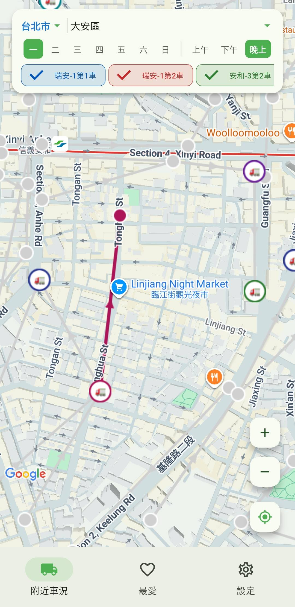
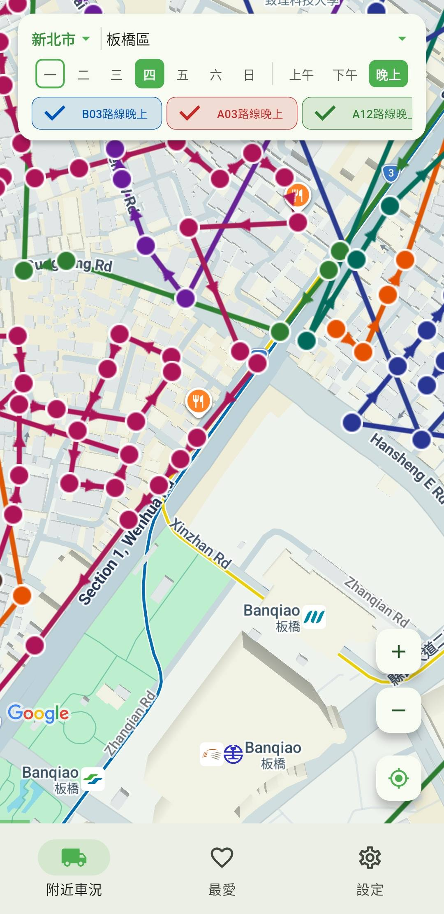

# 雙北垃圾車時刻表

整合台北市與新北市政府開放資料的 Flutter Android App，讓你在地圖上即時掌握垃圾車路線、站點與車輛位置。

> 出門倒垃圾不用再掐時間盯著路口 — 打開 App 就知道車子大概到哪了。

---

## ✨ 功能

- 🗺️ **地圖檢視**：於 Google Maps 上顯示雙北 ~30,000 個收運站點與 10 條路線軌跡
- 🚛 **車輛位置**：新北市即時 GPS、台北市依時刻表推估（UI 一致）
- 📍 **GPS 自動偵測城市**：跨板橋 / 萬華邊界時自動切換資料來源
- ⏰ **到站通知**：指定路線前 N 站推播提醒（可自訂）
- ❤️ **最愛路線**：常用站點一鍵收藏
- 🌓 **深色模式**：含 Google Maps dark style
- 📶 **離線可用**：資料打包為 asset + SQLite 24h 快取，無網路也能查

---

## 📱 畫面預覽

| 台北市（推估車輛位置） | 新北市（即時 GPS） | 我的最愛 |
|:--:|:--:|:--:|
|  |  |  |
| 大安區臨江夜市一帶，紫/綠/藍三條路線。🚛 圖示依時刻表推估位置 | 板橋區車站周邊，多條路線交錯，箭頭標示行進方向 | 儲存的站點時刻，含星期 / 類別（垃圾、回收、廚餘） |

---

## 🧰 技術棧

| 項目 | 版本 / 選擇 |
|------|------------|
| Framework | Flutter 3.41.6 / Dart 3.11.4 |
| 目標平台 | Android 21+ |
| 地圖 | `google_maps_flutter` ^2.10 |
| 定位 | `geolocator` ^13.0 + `permission_handler` ^11.3 |
| 快取 | `sqflite` ^2.4 + `shared_preferences` ^2.3 |
| 通知 | `flutter_local_notifications` ^19.0 |
| Icon | `flutter_launcher_icons` ^0.14 |

---

## 🏗️ 架構

```
lib/
├── main.dart                         # Service 注入、主題切換
├── models/                           # RouteStop / TruckLocation
├── pages/
│   ├── home_page.dart                # 主地圖頁（大部分邏輯）
│   ├── favorites_page.dart
│   └── settings_page.dart
└── services/
    ├── garbage_data_service.dart     # 統一資料服務（整合雙北）
    ├── api_service.dart              # 新北市 API
    ├── taipei_api_service.dart       # 台北市 API
    ├── cache_service.dart            # SQLite 24h 快取
    ├── csv_parser.dart               # 跨行引號 CSV 解析
    ├── spatial_index.dart            # Grid 空間索引（O(n) → O(~100)）
    ├── favorites_service.dart        # 最愛（ChangeNotifier）
    ├── settings_service.dart
    └── notification_service.dart
```

### 關鍵設計決策

- **資料三層 fallback**：Asset（離線）→ API（即時）→ 記憶體快取
- **空間索引**：地圖平移 / 縮放查詢附近站點，避免 O(26000) 暴力掃描
- **快取 + 事件驅動重建**：`_cachedMarkers` / `_cachedPolylines` 僅在資料變化時重算，`build()` 只讀快取
- **`ValueNotifier` 取代每秒 `setState`**：進度條動畫不觸發整棵 widget tree rebuild
- **資料驅動城市偵測**：比較雙市 `findNearest()` 距離，避免矩形邊界誤判（例：新埔站雖在板橋區，但經緯度接近萬華）

詳細設計歷程請見 [`DEVELOPMENT_NOTES.md`](./DEVELOPMENT_NOTES.md)。

---

## 🚀 在本機執行

### 1. 前置需求

- Flutter SDK 3.41+
- Android SDK（含 API 21+ platform & build-tools）
- Google Maps API Key（[申請教學](https://developers.google.com/maps/documentation/android-sdk/get-api-key)）

### 2. 取得 API Key 並設定

```bash
cp android/local.properties.example android/local.properties
```

編輯 `android/local.properties`，填入你的 key：

```properties
sdk.dir=/path/to/your/Android/sdk
flutter.sdk=/path/to/your/flutter
MAPS_API_KEY=AIza...你的_key
```

> 🔒 `local.properties` 已在 `.gitignore`，不會被提交。

**建議在 Google Cloud Console 設定限制**：
- 應用程式限制：Android app + package name `com.ntpc.ntpc_garbage_truck` + 你的 SHA-1
- API 限制：只允許 Maps SDK for Android

取得 debug SHA-1：

```bash
keytool -list -v -keystore ~/.android/debug.keystore \
  -alias androiddebugkey -storepass android | grep SHA1
```

### 3. 安裝 dependencies

```bash
flutter pub get
```

### 4. 執行

```bash
# 實機（建議）
flutter run --profile

# 模擬器（必須關 Impeller，否則 Google Maps 會 crash）
flutter run -d emulator-5554 --no-enable-impeller
```

### 5. 打包 Release APK

```bash
flutter build apk --release
# 產出：build/app/outputs/flutter-apk/app-release.apk
```

安裝到實機：

```bash
adb install -r build/app/outputs/flutter-apk/app-release.apk
```

---

## 🗂️ 資料來源

| 城市 | 來源 | 備註 |
|------|------|------|
| 新北市 | [data.ntpc.gov.tw](https://data.ntpc.gov.tw/) | JSON endpoint 有 WAF，改用 CSV |
| 台北市 | [data.taipei](https://data.taipei/) | 無即時 GPS，車輛位置由時刻表推估 |

資料已打包為 `assets/*.csv`（新北 ~26,700 筆、台北 ~4,000 筆），首次啟動即時可用；之後若 API 有更新，透過 SQLite 24h 快取機制背景更新。

---

## ⚠️ 已知限制

- **僅支援 Android**：iOS 未測試（尚未申請 iOS Maps API Key）
- **台北車輛位置為推估值**：因該市無即時 GPS API，僅依時刻表顯示「預估」位置
- **模擬器需 `--no-enable-impeller`**：Impeller 渲染器與 Google Maps 在 Android Emulator 上不相容
- **週日服務**：台北市資料無星期欄位，預設週一至週六，實際以當地公告為準

---

## 🛠️ 開發指令

```bash
# 更新 App Icon（改圖後執行）
dart run flutter_launcher_icons

# 模擬器設定 GPS 位置（測試跨市切換用）
adb -s emulator-5554 emu geo fix 121.4611 25.0143  # 捷運新埔站

# 安全檢查 — 推 repo 前掃 API Key
grep -rE "AIza|ghp_|sk_|Bearer" --exclude-dir=.git --exclude-dir=build .
```

---

## 📄 License

MIT

---

## 🙏 致謝

- [新北市政府資料開放平台](https://data.ntpc.gov.tw/)
- [臺北市政府資料開放平台](https://data.taipei/)
- Flutter 及所有相依套件的開發者

如果這個 App 幫到你，歡迎 Star ⭐ 或提 Issue 回饋 🐛
